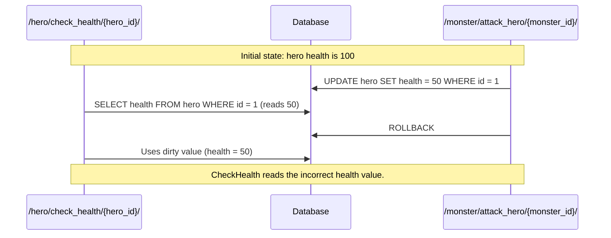
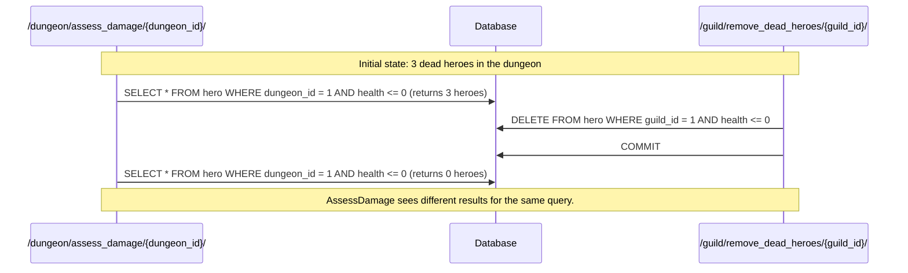
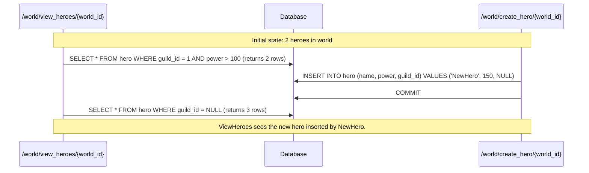

# Concurrency Control Mechanisms

### Case 1: Dirty Read

**Scenario**: The `/hero/check_health/{hero_id}/` endpoint reads the health of a hero that the `/monster/attack_hero/{monster_id}/` endpoint has updated but not yet committed. If the `/monster/attack_hero/{monster_id}/` transaction rolls back, the `/hero/check_health/{hero_id}/` endpoint will have read a value that never actually existed in the database.

**Sequence Diagram**:

### Case 2: Non-Repeatable Read

**Scenario**: The `/dungeon/assess_damage/{dungeon_id}/` endpoint reads the list of dead heroes in a dungeon. The `/guild/remove_dead_heroes/{guild_id}/` endpoint removes dead heroes from the guild and commits. When `/dungeon/assess_damage/{dungeon_id}/` reads the list again, it gets a different result.

**Sequence Diagram**:

### Case 3: Phantom Read

**Scenario**: The `/world/view_heroes/{world_id}` endpoint reads a list of heroes. The `/world/create_hero/{world_id} `endpoint inserts a new hero with power greater than 100 and commits. When `/world/view_heroes/{world_id}` reads the heroes again, it sees the new hero.

**Sequence Diagram**:

