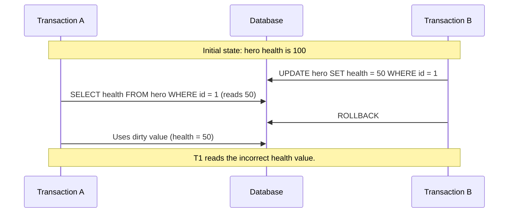
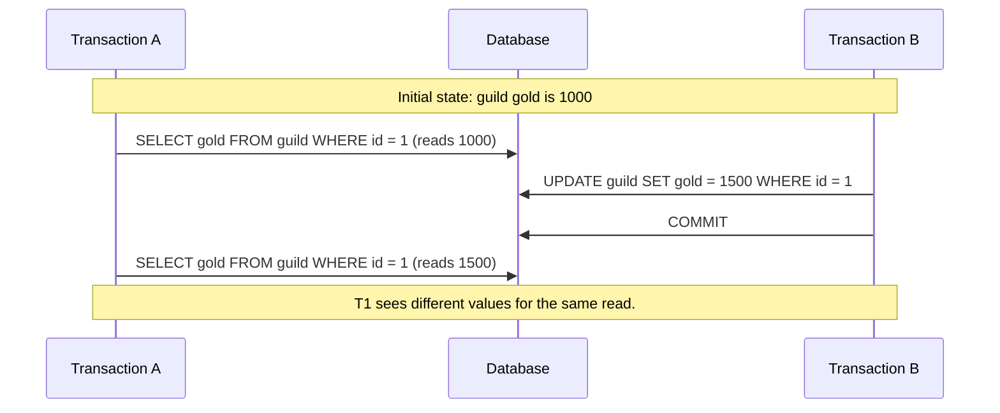
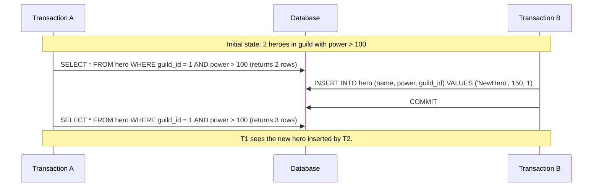

# Concurrency Control Mechanisms

### Case 1: Dirty Read

**Scenario**: Transaction A reads the health of a hero that Transaction B has updated but not committed. Transaction B then rolls back, but Transaction A has already read the uncommitted value.

**Sequence Diagram**:

### Case 2: Non-Repeatable Read

**Scenario**: Transaction A reads the gold of a guild. Transaction B updates the guild's gold and commits. Transaction A then reads the guild's gold again and gets a different result.

**Sequence Diagram**:

### Case 3: Phantom Read

**Scenario**: Transaction A reads all heroes in a guild with power greater than 100. Transaction B inserts a new hero with power greater than 100 and commits. Transaction A then reads the heroes again and sees the new hero.

**Sequence Diagram**:

